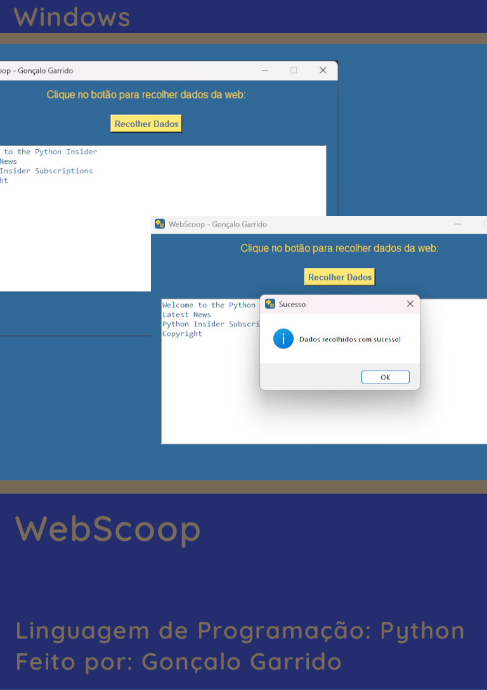

# Visuais

## Paleta de Cores
| Cor 1 (Branco) | Cor 2 (Cinza Claro) | Cor 3 (Cinza Médio) | Cor 4 (Cinza Escuro) | Cor 5 (Preto) |
|----------------|---------------------|----------------------|----------------------|---------------|
|  `#FFFFFF` |  `#D3D3D3` |  `#A9A9A9` |  `#696969` |  `#000000` |

## Icons

## Banner

## Capa

## Prints
### Print 1
**Nome:** Print 1  
**Descrição:** Descrição do Print 1  

### Print 2
**Nome:** Print 2  
**Descrição:** Descrição do Print 2  

### Print 3
**Nome:** Print 3  
**Descrição:** Descrição do Print 3  

### Print 4
**Nome:** Print 4  
**Descrição:** Descrição do Print 4  

### Print 5
**Nome:** Print 5  
**Descrição:** Descrição do Print 5  

### Print 6
**Nome:** Print 6  
**Descrição:** Descrição do Print 6  

