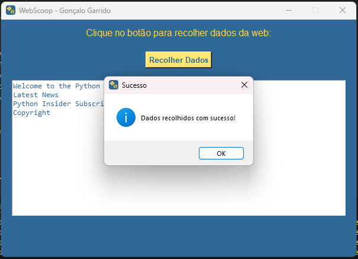

#   Nome do Projeto

Descrição breve do projeto.

## Descrição

Explique aqui o propósito do projeto, os conceitos que aborda e o que espera aprender ou realizar com ele.

## Funcionalidades

- [ ] Funcionalidade 1
- [ ] Funcionalidade 2
- [ ] Funcionalidade 3

## Tecnologias Utilizadas

- Linguagem de Programação: [Nome da Linguagem]
- IDE: [Nome da IDE]

## Prints de Tela

Visuais -> [Ver Agora](./Docs/Pages/Visual.md)

| Print 1 | Print 2 | Print 3 |
|---------|---------|---------|
|  |  |  |

## Como Utilizar

Explique aqui como iniciar ou usar o projeto, com exemplos de comandos e parâmetros que podem ser passados.

comando para iniciar o projeto

## Contribuições

Contribuições são bem-vindas! Sinta-se à vontade para enviar issues ou pull requests.

## Autor
 
Nome: Gonçalo Garrido  
Email: Goncalosantosgarrido+LearningProgram@gmail.com  

