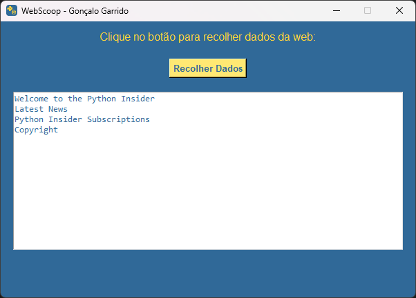

#  <br>WebScoop


**WebScoop** é uma aplicação desenvolvida em Python que permite a recolha de dados automatizada a partir de sites da web. Ideal para projetos de análise de dados e monitorização de informações, essa ferramenta simplifica o processo de scraping de dados.

## Descrição

O **WebScoop** foi criado para facilitar a recolha de dados da web, automatizando a extração de informações de sites de forma eficiente. Com uma interface intuitiva construída com Tkinter e funcionalidades de scraping via BeautifulSoup, a aplicação é uma solução versátil para profissionais que precisam de acesso a dados atualizados sem intervenção manual.

## Funcionalidades

- [x] Recolha de dados de sites com um clique.
- [x] Exibição de resultados em uma interface amigável.
- [x] Exportação de dados para uso posterior.

## Tecnologias Utilizadas

- Linguagem de Programação: Python 3.13
- IDE: Visual Studio Code

## Prints de Tela

Visuais -> [Ver Agora](./Docs/Pages/Visual.md)

| Print 1 | Print 2 | Print 3 |
|---------|---------|---------|
|  |  |  |

## Como Utilizar

Para utilizar o **WebScoop**, siga os seguintes passos:

### Instalação de Dependências
Execute os comandos abaixo para instalar as bibliotecas necessárias:

```bash
python -m pip install requests
python -m pip install beautifulsoup4
```

### Iniciar a Aplicação

1.  Abra o terminal na pasta do projeto.
2.  Execute o script `main.py`:

    bash

    Copy code

    `python main.py`

### Requisitos

-   Python 3.x
-   Conexão à internet para aceder aos sites de destino.

## Contribuições

Contribuições são bem-vindas! Sinta-se à vontade para enviar issues ou pull requests.

## Autor
<br>
Nome: Gonçalo Garrido <br>
Email: Goncalosantosgarrido+LearningProgram@gmail.com<br><br>
[](https://goncalogarrido2.github.io/GoncaloGarrido/)

